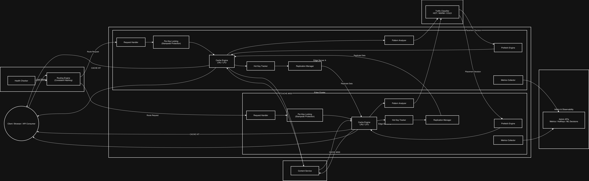

# 🌫️ **FogCache — Intelligent Distributed CDN System**

> **FogCache** is a production-grade distributed caching and content delivery platform that combines high-performance edge caching, adaptive replication, machine-learning-driven placement, and fault-tolerant design to deliver low-latency content at scale.

---

## 📌 1. Project Overview

FogCache is designed to simulate and implement real-world **Content Delivery Network (CDN)** behavior.
It improves application performance by caching content at edge nodes close to clients while dynamically adapting to traffic patterns using analytics and machine learning.

### 🎯 Goals

* Reduce request latency through intelligent edge caching
* Minimize load on the origin server
* Provide high availability and resilience under failures
* Adapt automatically to traffic using analytics and ML
* Validate correctness, performance, and reliability through rigorous testing

---

## 🛠️ 2. Development Process

FogCache was developed using a **production-first engineering methodology**:

1. **Correctness & Consistency**
2. **Performance Optimization**
3. **Resilience & Fault Tolerance**
4. **Traffic Intelligence & ML Integration**
5. **Deployment & Real-World Validation**

### 🧰 Technologies & Tools

* **Language:** Java
* **Framework:** Spring Boot
* **Networking:** REST APIs
* **Concurrency:** Java Executors & Locks
* **Caching:** Custom LRU & LFU cache engines
* **Machine Learning:** Python + Flask microservice
* **Deployment:** Docker, Docker Compose
* **Testing Tools:** ApacheBench (ab), curl, chaos testing, fault injection

---

## 🧩 3. Services Used

| Service                 | Responsibility                                    |
| ----------------------- | ------------------------------------------------- |
| **Origin Server**       | Source of truth for all content                   |
| **Edge Server**         | Caches and serves client content                  |
| **Load Balancer**       | Routes traffic across healthy edges               |
| **Cache Engine**        | Implements LRU/LFU, eviction, stampede protection |
| **Hot-Key Tracker**     | Detects heavy-traffic content                     |
| **Replication Manager** | Replicates hot content across edges               |
| **Prefetch Engine**     | Proactively warms cache                           |
| **Pattern Analyzer**    | Extracts real-time traffic features               |
| **ML Service**          | Predicts content classification (HOT/WARM/COLD)   |
| **Metrics Engine**      | Records latency, hits, misses, errors             |
| **Admin APIs**          | Exposes system observability                      |

---

## 🧭 System Architecture

> **Click the image to open it in full size.**
> Use your mouse / trackpad to zoom and scroll in the viewer.

<p align="center">
  <a href="docs/fogcache_flow.drawio.png">
    
  </a>
</p>

<details>
<summary>🧩 Why this diagram matters</summary>

This architecture illustrates the complete FogCache pipeline:

* Client → Load Balancer → Edge Servers
* Edge Cache with LRU/LFU eviction
* Hot-Key detection & adaptive replication
* Prefetching & ML-based placement
* Pattern analysis & feature extraction
* Metrics, Admin APIs & observability
* Origin shielding & automatic recovery

The design represents a real-world **CDN + intelligent control plane**.

</details>

---

## 📤 4. Outputs of Each Service

| Component           | Output                                |
| ------------------- | ------------------------------------- |
| Origin Server       | Raw content data                      |
| Edge Server         | Cached content, low-latency responses |
| Load Balancer       | Stable routing decisions              |
| Cache Engine        | HIT/MISS decisions, evictions         |
| Hot-Key Tracker     | Hot-key detection logs                |
| Replication Manager | Cross-edge data durability            |
| Prefetch Engine     | Preloaded cache entries               |
| Pattern Analyzer    | Feature vectors                       |
| ML Service          | Content classification & confidence   |
| Metrics Engine      | Latency, hit ratio, throughput        |
| Admin APIs          | Cluster & system visibility           |

---

## 🧪 5. Testing Phases and Results

FogCache was validated through **27 structured testing phases**, covering correctness, performance, resilience, intelligence, and deployment.

### 🧱 Phases 1–4: Core Correctness

* HIT/MISS validation
* LRU/LFU eviction correctness
* Origin consistency
* **Result:** All correctness constraints satisfied

### 🌐 Phases 5–7: Distribution & Observability

* Load balancing
* Failover validation
* Per-edge metrics isolation
* **Result:** Deterministic routing & observability verified

### ⚡ Phase 8: Stress & Throughput

* **Tool:** ApacheBench
* **Results:**

  * **2000+ RPS**
  * **99% cache hit ratio**
  * **4× latency reduction**

### 🧬 Phases 9–13: Replication & Concurrency

* Replication correctness
* Cache stampede prevention
* **Result:** Single origin call under 50 concurrent requests

### 🧯 Phase 14: Chaos Engineering

* Random node failures
* Zero downtime
* Automatic recovery

### 📊 Phases 15–16: Observability & Analytics

* Real-time pattern extraction
* Metrics correctness

### 🧠 Phases 17–19: Intelligence & ML

* Java → Python ML pipeline
* Adaptive placement & predictive prefetching

### 🧯 Phase 20: Quorum & Fault-Tolerant Replication

* Survived partial failures with no outage

### 🧩 Phase 24: Docker Deployment

* DNS service discovery
* End-to-end correctness in containers

### 🧪 Phase 27: Final Regression

* **100% test pass**
* Production-grade system stability

---

## 🏆 6. Results Achieved

* **Latency reduction:** ~4×
* **Cache hit ratio:** ~99%
* **Throughput:** 2000+ RPS
* **Origin load reduction:** >95%
* **Zero data loss under failures**
* **ML-driven adaptive system behavior**

---

## ⚡ 7. Performance Improvements

| Metric           | Before   | After            |
| ---------------- | -------- | ---------------- |
| Latency          | ~17 ms   | ~4 ms            |
| Origin Calls     | 100+     | <5               |
| Failure Recovery | Manual   | Automatic        |
| System Stability | Moderate | Production-grade |

---

## ▶️ 8. Instructions for Use

### Run with Docker

```bash
docker compose up
```

### Test the System

```bash
curl http://localhost:8083/content?id=demo
curl http://localhost:8083/content?id=demo
```

### View Metrics

```bash
curl http://localhost:8083/metrics
```

### Admin APIs

```bash
curl http://localhost:8083/admin/nodes
curl http://localhost:8083/admin/hotkeys
curl http://localhost:8083/admin/ml/decisions
```

---

## 🔮 9. Future Work

* Kubernetes multi-edge scaling
* Advanced ML models
* Geo-aware routing
* Persistent observability backend
* Visual monitoring dashboard

---

## 🙏 10. Acknowledgments

* ApacheBench
* Docker & Spring Boot ecosystems
* Distributed systems & CDN research
* Open-source community
